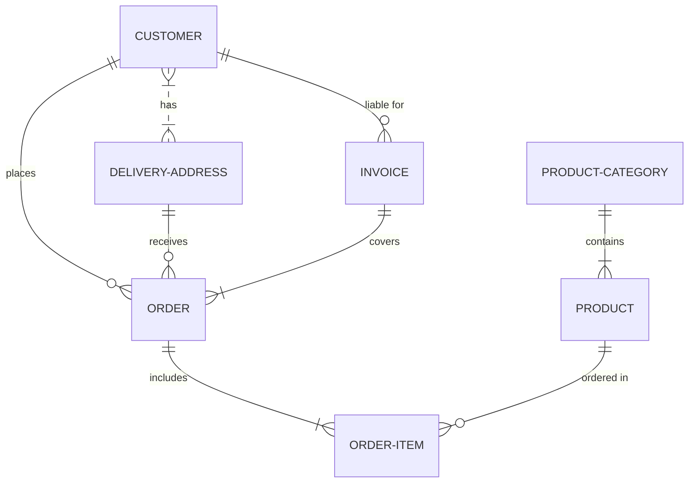

# Proyecto de Estudio!
    
**Estructura del documento principal:**

# PRESENTACIÓN (Sistema de Riegos Inteligentes)

**Asignatura**: Bases de Datos I (FaCENA-UNNE)

**Integrantes**:
        - Gálvez Díaz Colodrero, Mateo Nicolás.
		- Noir Aguilar, Nahuel Kevin.
		- Ojeda, Juan Agustín.
		- Sánchez Morales, Benjamín Delfor.

**Año**: 2025

CAPÍTULO I: INTRODUCCIÓN
Caso de estudio

El presente documento aborda el diseño y desarrollo de un sistema de gestión para un sistema de riego inteligente en parcelas agrícolas. Este sistema tiene como finalidad monitorear la humedad del suelo y controlar de manera automática el riego de los cultivos, garantizando un uso eficiente del agua y una mejor productividad agrícola.

El sistema permitirá almacenar y gestionar información relacionada con sensores de humedad, parcelas, cultivos, historial de riegos y condiciones ambientales, además de ofrecer reportes para el análisis de datos. De esta manera, se busca optimizar el uso de recursos hídricos y mejorar la sostenibilidad de la producción agrícola.

El proyecto está diseñado para proporcionar una solución tecnológica accesible, confiable y escalable, que apoye a los agricultores en la toma de decisiones y contribuya a la modernización del sector.

Definición o planteamiento del problema

El objetivo principal del sistema es resolver una serie de problemas presentes en la gestión de riego agrícola:

Riego ineficiente: Muchos agricultores riegan de forma manual o con sistemas no automatizados, lo que provoca un consumo excesivo de agua y afecta la salud del cultivo.

Falta de monitoreo en tiempo real: No existen registros sistemáticos de la humedad del suelo ni del historial de riego, dificultando la toma de decisiones basadas en datos.

Gestión desorganizada de parcelas y cultivos: Sin un sistema que centralice la información, los agricultores pierden tiempo y precisión al administrar múltiples parcelas con diferentes cultivos.

Ausencia de reportes y análisis: La carencia de estadísticas sobre humedad, riego y producción impide mejorar el rendimiento y optimizar los recursos.

Control limitado del sistema de riego: No se cuenta con alertas o permisos diferenciados para usuarios (por ejemplo, técnicos, administradores o agricultores), lo cual puede generar errores en la operación.

Objetivos del Trabajo Práctico

El objetivo principal del trabajo es desarrollar un sistema de gestión para un sistema de riego inteligente que permita monitorear la humedad del suelo, automatizar el riego y gestionar la información agrícola de manera eficiente.

Objetivos Generales

Crear un sistema integrado que optimice la gestión del agua y el control de los cultivos, brindando reportes confiables y herramientas de análisis para mejorar la productividad agrícola.

Objetivos Específicos

Integrar el registro de sensores de humedad, cultivos, parcelas y riego en una única plataforma.

Automatizar el proceso de riego mediante reglas basadas en los niveles de humedad detectados.

Implementar un sistema de roles y permisos para garantizar un acceso seguro a la información.

Generar reportes de humedad, consumo de agua y rendimiento agrícola para la toma de decisiones.

Optimizar el uso del recurso hídrico y contribuir a la sostenibilidad del sector agrícola.

CAPÍTULO II: MARCO CONCEPTUAL O REFERENCIAL

TEMA 1: Manejo de permisos a nivel de usuarios de base de datos
Acceder a la siguiente carpeta para ver el desarrollo del tema Manejo de permisos a nivel de usuarios de base de datos.

TEMA 2: Procedimientos y funciones almacenadas
Acceder a la siguiente carpeta para ver el desarrollo del tema Procedimientos y funciones almacenadas.

TEMA 3: Optimización de consultas a través de índices
Acceder a la siguiente carpeta para ver el desarrollo del tema Optimización de consultas a través de índices.

TEMA 4: Índices columnares en SQL Server
Acceder a la siguiente carpeta para ver el desarrollo del tema Índices columnares en SQL Server.

CAPÍTULO III: METODOLOGÍA SEGUIDA
a) Cómo se realizó el Trabajo Práctico

Primero se definió el caso de estudio: un sistema de riego inteligente aplicado a la agricultura. La idea fue seleccionada por su importancia actual en la gestión sostenible de recursos naturales.

Luego se diseñó el Modelo Entidad-Relación (ER) que incluye entidades como Sensores, Parcelas, Cultivos, Riego, Usuarios y sus relaciones. Posteriormente, se elaboró el Diccionario de Datos, la carga inicial de datos de prueba y se desarrollaron consultas SQL para los distintos temas planteados.

Cada integrante del grupo seleccionó un tema específico para su desarrollo:

Manejo de permisos a nivel de usuarios de base de datos.

Procedimientos y funciones almacenadas.

Optimización de consultas a través de índices.

Índices columnares en SQL Server.

b) Herramientas (Instrumentos y procedimientos)

ERD Plus: Utilizada para el diseño conceptual del modelo de datos.

SQL Server Management Studio 20: Software de administración de base de datos para la implementación de las tablas, relaciones y consultas.

## CAPÍTULO IV: DESARROLLO DEL TEMA / PRESENTACIÓN DE RESULTADOS 

Maecenas molestie lacus tincidunt, placerat dolor et, ullamcorper erat. Mauris tortor nisl, ultricies ac scelerisque nec, feugiat in nibh. Pellentesque interdum aliquam magna sit amet rutrum. 

### Diagrama conceptual (opcional)
Ejemplo usando Live Editor https://mermaid.js.org/ (ejemplo opcional)

### Diagrama relacional

### Diccionario de datos

Acceso al documento [PDF](doc/diccionario_datos.pdf) del diccionario de datos.

### Desarrollo TEMA 1 "----"

Fusce auctor finibus lectus, in aliquam orci fermentum id. Fusce sagittis lacus ante, et sodales eros porta interdum. Donec sed lacus et eros condimentum posuere. 

> Acceder a la siguiente carpeta para la descripción completa del tema [scripts-> tema_1](script/tema01_nombre_tema)

### Desarrollo TEMA 2 "----"

Proin aliquet mauris id ex venenatis, eget fermentum lectus malesuada. Maecenas a purus arcu. Etiam pellentesque tempor dictum. 

> Acceder a la siguiente carpeta para la descripción completa del tema [scripts-> tema_2](script/tema02_nombre_tema)

... 

## CAPÍTULO V: CONCLUSIONES

Nunc sollicitudin purus quis ante sodales luctus. Proin a scelerisque libero, vitae pharetra lacus. Nunc finibus, tellus et dictum semper, nisi sem accumsan ligula, et euismod quam ex a tellus. 

## BIBLIOGRAFÍA DE CONSULTA

 1. List item
 2. List item
 3. List item
 4. List item
 5. List item

